# Retail sales analytics

This project provides a data pipeline for retail sales analytics using Apache Airflow, PostgreSQL, and MinIO. It includes tasks for extracting, validating, and loading data from CSV files into a PostgreSQL database, and generating reports.

## Prerequisites
- Docker
- Docker Compose
- Python 3.12 or higher
- Apache Airflow 3.0 or higher
- PostgreSQL
- MinIO
- Apache Superset or Power BI (optional for dashboarding)
- Basic knowledge of SQL and Python
- Basic understanding of Docker and Docker Compose
## Project Structure
```


## Getting Started

1. Clone the repository:

```bash
git clone <repository-url>
cd retail-sales-analytics
```

2. Create a `.env` file in the root directory with the following content from `.env.example`:


```bash
cp .env.example .env
```

3. Start the services using Docker Compose:

```bash
start_docker.sh
```

4. Access the Airflow web interface at `http://localhost:8080` and log in with the credentials defined in your `.env` file.


You can get the airflow user passwords by running the following command inside the Airflow container:

```bash
cat $AIRFLOW_HOME/simple_auth_manager_passwords.json.generated
```
> Note: This method is only for development purposes. In production, use a secure method to manage passwords.

5. Upload your CSV files to the MinIO bucket specified in your `.env` file.

6. Trigger the DAG in the Airflow web interface to start the data pipeline.

## Data Pipeline Overview
The data pipeline consists of the following steps:

1. **Extract and Validate CSVs**: Extracts data from CSV files and validates it.
2. **Load to Staging Tables**: Loads the validated data into staging tables in PostgreSQL.
3. **Create Fact and Dimension Tables**: Transforms the data into fact and dimension tables.
4. **Trigger Dashboard Update**: Updates the Superset dashboard or exports data to Power BI.


## Data Flow Diagram
The data flow diagram illustrates the process from raw CSV files to the final dashboard update or Power BI export.

```mermaid
graph TD
    A[Raw CSVs → MinIO] --> B[Extract + Validate CSVs]
    B --> C[Load to Staging Tables]
    C --> D[Create Fact + Dim Tables]
    D --> E[Trigger Superset Dashboard Update or Power BI Export]
```

